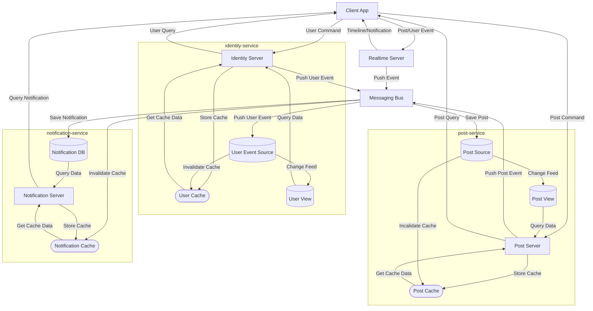

# SNSアプリ要件定義

## ユースケース

### ユーザー関連

- ユーザーの作成，更新(公開情報)

- ユーザー情報の取得

- ユーザー検索(保留)

- ユーザーフォロー(通知あり)

### 投稿関連

- 投稿の作成，変更

- いいね，ブースト(通知あり)

- リプライの作成，変更(通知あり)

- フォローユーザーの最近の投稿取得(タイムライン)

- 特定ユーザーの投稿をn件取得(プロフィールからの取得)

- 人気投稿をn件取得

- いいねしたユーザーのn件取得

- ブーストしたユーザーのn件取得

- リプライのn件取得

- タイムラインのリアルタイム更新

- 投稿検索(保留)

### 通知関連

- 通知の取得(リアルタイム)

- 時系列順に通知の取得n件取得

## アーキテクチャ

## 各分野詳細
[フロントエンド要件定義](./frontend/README.md)

[バックエンド要件定義](./backend/README.md)