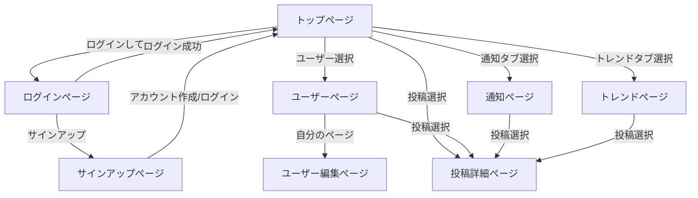

# フロントエンド要件定義
## 使用技術

Blazor WebAssembly

## ルーティング
### トップページ
route: `/`

アプリのトップページ。ログインしていない場合はログイン画面にリダイレクトされる。
タイムラインが表示される。

### ログインページ
route: `/login`

ログイン画面。Emailとパスワードを入力してログインする。
サインアップページへのリンクがある。

### サインアップページ
route: `/signup`

サインアップ画面。名前、Email、パスワードを入力してアカウントを作成する。

### ユーザーページ
route: `/users/:id`

ユーザーのプロフィールページ。ユーザーの名前、プロフィール画像、フォロー数、フォロワー数、投稿数、フォローボタンが表示される。
ユーザーの投稿が表示される。
自分のページの場合はプロフィール編集ボタンが表示される。

### ユーザー編集ページ
route: `/users/:id/edit`

ユーザーのプロフィール編集ページ。名前、プロフィール画像、自己紹介を編集できる。

### 投稿詳細ページ

route: `/posts/:id`

投稿の詳細ページ。投稿の内容、投稿者の名前、投稿日時、いいね数、コメント数、いいねボタン、コメントフォーム、コメント一覧が表示される。

### トレンドページ
route: `/trends`

トレンドの一覧ページ。トレンド投稿の一覧が表示される。

### 通知ページ

route: `/notifications`

通知の一覧ページ。フォロー、いいね、コメントの通知が表示される。

### notfoundページ

route: `/notfound`

ページが見つからない場合に表示されるページ。

### fobiddenページ

route: `/fobidden`

アクセス権限がない場合に表示されるページ。

### errorページ

route:`/error`

エラーが発生した場合に表示されるページ。

### ページ遷移
